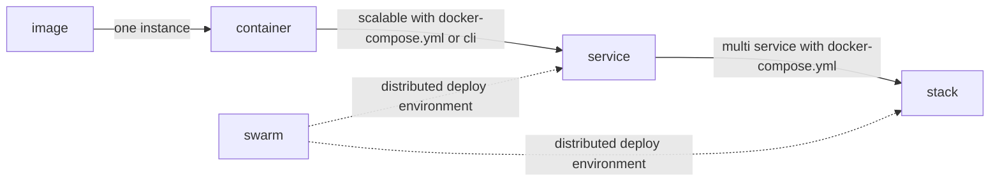

# docker 进阶

## docker machine

docker machine 是一个快速建立 `docker swarm` 的多机虚拟机的工具，使本身不通过虚拟化服务，需要借助 virtualbox 或者 hyperv（win10） 或  xhyve（macOS）等等

创建命令如下，使用 `-d` 指定驱动.注意，必须事先在 Hyper-V 管理器中新建一个 外部虚拟交换机 执行下面的命令时，使用 `--hyperv-virtual-switch=MY_SWITCH` 指定虚拟交换机名称

```shell
docker-machine create -d virtualbox test
docker-machine create -d hyperv --hyperv-virtual-switch=MY_SWITCH test
```

使用 docker machine 创建的虚拟机里面可以直接 docker (不包括 docker compose?)，通过 `docker-machone ssh test` 可以直接连到虚拟机上

### docker machine 常见命令

- `active` 查看活跃的 Docker 主机
- `config` 输出连接的配置信息
- `create` 创建一个 Docker 主机
- `env` 显示连接到某个主机需要的环境变量
- `inspect` 输出主机更多信息
- `ip` 获取主机地址
- `kill` 停止某个主机
- `ls` 列出所有管理的主机
- `provision` 重新设置一个已存在的主机
- `regenerate-certs` 为某个主机重新生成 TLS 认证信息
- `restart` 重启主机
- `rm` 删除某台主机
- `ssh` SSH 到主机上执行命令
- `scp` 在主机之间复制文件
- `mount` 挂载主机目录到本地
- `start` 启动一个主机
- `status` 查看主机状态
- `stop` 停止一个主机
- `upgrade` 更新主机 Docker 版本为最新
- `url` 获取主机的 URL
- `version` 输出 docker-machine 版本信息
- `help` 输出帮助信息

## docker compose

`dockerfile` 里大多的命令都可以在 Compose file 里作为配置项，[配置文件语法](https://docs.docker.com/compose/compose-file/)

```yml
version: "3"

services:
  db:
    image: postgres
    networks:
      - webnet
  nginx:
    image: nginx
    networks:
      - webnet
    config:
      - source: site.conf
        target: /etc/nginx/conf.d/site.conf
  web:
    image: username/repo:tag
    ports:
      - "4000:80"
    networks:
      - webnet
    # 依赖于哪一个服务，只保证启动先后顺序
    depends_on:
      - env
      - nginx
    environment:
      - USER_NAME=admin
    volumes:
      - /your/path:/container/path
      - volume_name:/container/path
    # 从文件里提前环境变量
    env_file:
      - ./common.env

config:
  site.conf:
    file: ./site.conf

volumes:
  volume_name:

networks:
  # 默认设置是一个自带负载均衡的网络
  webnet:
```

相同的文件可以创建多个，最后的节点实例上都是以 service-name_# 为格式命名的，如 web_1，同时还会加上 compose 文件的上一层文件夹的名称，但是 `docker-compose up` 的配置不能有 `deploy` 项，有该项的应当用 `docker stack deploy -c` 命令去启动，终究 `docker-compose up` 只是适用于调试模式

## service


> Services allow you to scale containers across multiple Docker daemons, which all work together as a swarm with multiple managers and workers.
> Service is 'containers in production'

使用命令行来创建

```shell
docker service create --replicas 3 -p 80:80 --name nginx nginx:1.13.7-alpine
```

或者使用 docker-compose.yml 文件来创建，即在单个 `service` 里面指定 `deploy` 项来设置其容器数量

```yml
version: "3"
services:
  web:
    # replace username/repo:tag with your name and image details
    image: username/repo:tag
    deploy:
      replicas: 5
      resources:
        limits:
          cpus: "0.1"
          memory: 50M
      restart_policy:
        condition: on-failure
    ports:
      - "4000:80"
    networks:
      - webnet
networks:
  webnet:
```

使用 docker-compose.yml 文件的话可以创建多服务的组合，需要注意的是：**使用compose文件定义的服务只能在 swarm 模式下通过 stack 命令启动起来**，如命令 `docker stack deploy -c docker-compose.yml some_name`

### service 常用命令

- `docker service ls` 查看集群的运行的服务
- `docker service ps xxx` 查看某个服务的详情
- `docker service logs xxx` 查看某个服务的日志

## swarm mode

> A swarm is a group of machines that are running Docker and joined into a cluster.

`Swarm mode` 为模式，即 docker 在部署服务时候的模式，单机模式的（即没有运行 docker swarm init）或者 `Swarm mode` 集群模式

`Swarm mode` 内置 kv 存储功能，提供了众多的新特性，比如：具有容错能力的去中心化设计、内置服务发现、负载均衡、路由网格、动态伸缩、滚动更新、安全传输等。使得 Docker 原生的 Swarm 集群具备与 Mesos、Kubernetes 竞争的实力。

运行 Docker 的主机可以主动初始化一个 Swarm 集群或者加入一个已存在的 Swarm 集群，这样这个运行 Docker 的主机就成为一个 Swarm 集群的节点 (node) 。

节点分为管理 (manager) 节点和工作 (worker) 节点。docker swarm 命令基本只能在管理节点执行（节点退出集群命令 docker swarm leave 可以在工作节点执行）。一个 Swarm 集群可以有多个管理节点，但只有一个管理节点可以成为 leader，leader 通过 raft 协议实现

工作节点是任务执行节点，管理节点将服务 (`service`) 下发至工作节点执行（`task`）。**管理节点默认也作为工作节点**。你也可以通过配置让服务只运行在管理节点。


下图为 容器、任务、服务的关系


任务 （Task）是 Swarm 中的最小的调度单位，目前来说就是一个单一的容器。

服务 （Services） 是指一组任务的集合，服务定义了任务的属性。服务有两种模式：

- `replicated services` 按照一定规则在各个工作节点上运行指定个数的任务。

- `global services` 每个工作节点上运行一个任务

### 创建 swarm 集群

需要注意的是，如果是多网卡环境，无论是 docker swarm init 还是 docker swarm join，都不要忘记使用参数 --advertise-addr 指定宣告地址，否则自动选择的地址很可能不是你期望的，从而导致集群互联失败。格式为 --advertise-addr <地址>:<端口>，地址可以是 IP 地址，也可以是网卡接口，比如 eth0。端口默认为 2377，如果不改动可以忽略。

```shell
docker-machine create -d virtualbox manager
# 连接到创建的虚拟机上
docker-machine ssh manager
# 将 manager 初始化为 swarm 管理节点，这里的 ip 可以通过 docker-machine ls 来看到
docker swarm init --advertise-addr 192.168.99.100
# 上面的命令会输出加入创建的 swarm 集群的口令，之后的工作阶段就可以通过这个命令来连接到集群上
> docker swarm join \
    --token xxxxx \
    192.168.99.100:2377
```

创建工作节点，并连接到集群上

```shell
docker-machine create -d virtualbox worker1
docker-machine ssh worker1
# 接下来使用创建节点时候输出的 token 和 ip 来连接到集群上
docker swarm join --token xxxxx 192.168.99.100:2377
```

在管理节点上通过 `docker node ls` 命令即可查看当前集群中的机器，node 只有在 `swarm mode` 下才能使用

### 部署服务&分发任务

如果只是单个的 `container` 就不用使用集群去部署了，定义一个包含多个相同 `image` 的实例(`container`) 作为 `service`

如果当前 docker 环境不是 `swarm mode` 那么创建的 `service` 里的多实例会全部在在本机上运行，在 `swarm mode` 下创建 `service` 时候会自动进行服务的部署，即将 `image` 的实例化的 `container` 通过预设的规则分发到各个节点上，直接使用 `docker service create` 和使用 `docker stack deploy -c docker-compose.yml some_name` 部署时候都会在整个集群上进行

## stack

在介绍 service 的 compose file 定义方式时候和 `swarm mode` 下的部署就已经介绍过，该种服务需要通过 stack 命令来部署，即部署多服务如命令 `docker stack deploy -c docker-compose.yml wordpress`

如果在节点加入可视化服务，可以通过浏览器查看该 stack 的状态，其界面类似 **stack** 状


## 部署事宜

### 配置管理

一般可以通过环境变量传入，当环境变量较多，切较为私密时候可以通过文件方式加载，如在 compose 文件里

```yml
services:
  mysql-master:
    image: bergerx/mysql-replication:5.6
    env_file:
      - mysql.env
```

- docker secret

- docker config

可以通过命令来创建，也可以在 compose 文件里定义

```yml
services:
  web:
    image: docker.hashworld.top:5000/hashworld-backend
    config:
      - source: local
        target: /root/hashworld-backend/src/hashworld/settings/local

config:
  local:
    file: ./local.py
```

### 滚动升级

### stack 常用命令

stack 可以方便的查看、管理打包的 `service`，这时候也是可以通过 `service` 命令来查看

- `docker stack ls` 列出打包的服务
- `docker stack deploy` 部署服务
- `docker stack down` 移除服务，但是不会移除数据卷

## 对比

Docker Service是一种声明式的、可扩展的、负载均衡的应用。Docker Service是面向用户的应用，而Docker Swarm是面向IT的节点集群。

stack 包含一系列 service，这些 service 组成了应用。stack 通过一个 YAML 文件定义每个 service，并描述 service 使用的资源和各种依赖。



## 私有仓库

- [配置密码](https://docs.docker.com/registry/deploying/#native-basic-auth)
- [使用Nginx代理](https://docs.docker.com/registry/recipes/nginx/#setting-things-up)
- [问题参考](https://github.com/docker/distribution/issues/655)
- [博客参考](http://blog.51cto.com/unixman/1707423)

### 创建

```shell
docker run -d \
  -p 5000:5000 \
  --restart=always \
  --name registry \
  -v /opt/data/registry:/var/lib/registry \
  -e "REGISTRY_AUTH=htpasswd" \
  -e "REGISTRY_AUTH_HTPASSWD_REALM=Registry Realm" \
  -e REGISTRY_AUTH_HTPASSWD_PATH=/auth/htpasswd \
  registry:2
```

### 加密方式

docker 使用了 Appache 的密码加密工具 htpasswd , 这个工具可以生成用户名和加密密码字符串docker推荐的加密方式 `bcrypt` 可以使用命令 `htpasswd -Bbn admin admin` 来生成串 `admin:$2y$05$4Am1XtERHcw/mCB6RTnDu.4mXedJYvfLhPsFLQ47d42zusrskbAhK`，将这个字符串贴到密码本文件中，这时候使用Nginx代理如下

```conf
server {
   listen 443 ssl;
   server_name localhost;

   add_header Docker-Distribution-Api-Version registry/2.0 always;

   ssl on;
   ssl_certificate /etc/nginx/ssl/docker-registry.crt;
   ssl_certificate_key /etc/nginx/ssl/docker-registry.key;

   proxy_set_header Host $host;
   proxy_set_header X-Forwarded-For $proxy_add_x_forwarded_for;
   proxy_set_header X-Real-IP $remote_addr;
   proxy_set_header X-Forwarded-Proto $scheme;
   proxy_set_header X-Original-URI $request_uri;
   proxy_set_header Docker-Distribution-Api-Version registry/2.0;

   location / {
     auth_basic "Restricted";
     auth_basic_user_file /etc/nginx/.htpasswd;
     proxy_pass http://127.0.0.1:5000;
   }
}
```

结果可能不好使，因为 Nginx 的密码验证加密方式可能不支持 `bcrypt` 方式（可能跟系统的加密包有关），这时候会 Nginx 会返回内部错误，于是想到更换加密方式，那么使用常见的 MD5 来生成加密的密码 `htpasswd -bn admin admin` 来生成串 `admin:$apr1$ioyO84Hc$v0GfTSQu87PZpfyIK9G8I/`

对于没有 htpasswd 命令，可以使用 `printf "admin:$(openssl passwd -apr1 admin)\n"` 来生成，或者通过 `sudo apt-get install apache2-utils` 来安装

### Nginx 配置

对于 Ubuntu 14.04 可能只能安装到 nginx/1.4.6 这个版本是不支持 add_header 时候加上 always 的，这就比较尴尬了

```conf
add_header Docker-Distribution-Api-Version registry/2.0 always;
```

所以最好的还是使用官方的 docker Nginx 容器去进行代理比较保险，而且 nginx:alpine 直接支持 `bcrypt`

### 使用私有仓库

#### 添加私有仓库

- Ubuntu 14.04, Debian 7 Wheezy

  对于使用 upstart 的系统而言，编辑 /etc/default/docker 文件，在其中的 DOCKER_OPTS 中增加如下内容：
  `DOCKER_OPTS="--registry-mirror=https://registry.docker-cn.com --insecure-registry=docker.hashworld.top:5000"`
  并重新启动服务 `sudo service docker restart`

- Ubuntu 16.04+, Debian 8+, centos 7

  对于使用 systemd 的系统，请在 /etc/docker/daemon.json 中写入如下内容（如果文件不存在请新建该文件）

  ```json
  {
    "registry-mirror": [
      "https://registry.docker-cn.com"
    ],
    "insecure-registries": [
      "docker.hashworld.top:5000"
    ]
  }
  ```

需要注意的是 一个是 `--insecure-registry=` 一个是 `"insecure-registries": [`
使用https，需要自己生成根证书，需要自己派发，而且也需要重启

#### 使用方式

个需要上传的镜像重新打 tag，如原来的 alpine 可以 `docker tag alpine:latest your-site:5000/alpine:latest`，或者直接在 build 的时候指定带有该私有仓库对的前缀名

然后需要使用 `docker login your-site:5000` 去登录授权，之后直接 `docker push your-site:5000/alpine:latest` 就可以推送镜像

也可以在浏览器中打开 `http://your-site:5000/v2/` 进行登录，然后打开 `http://your-site:5000/v2/_catalog` 就可以看到该私有仓库下的镜像了

## 减小镜像体积

- 清除安装后的缓存
  - `apt-get` 需要 `rm -rf /var/cache/apt/* && rm -rf /var/lib/apt/lists/*`
  - `pip` 需要 `rm -rf ~/.cache/pip`


- 单独安装 build 依赖包，并在之后清除

```dockerfile
RUN apk --no-cache add --virtual build-dependencies \
      build-base \
      py-mysqldb \
      gcc \
      libc-dev \
      libffi-dev \
      mariadb-dev \
      && pip install -qq -r requirements.txt \
      && rm -rf .cache/pip \
      && apk del build-dependencies

RUN apk -q --no-cache add mariadb-client-libs
```

## 命令概览

- docker
    - container
        - start
        - stop
        - rm
        - ls
    - image
        - run
        - ls
    - volume
        - create
        - ls
        - rm
    - service
        - create
        - ls
        - ps
        - rm
        - scale
        - update
    - swarm
        - init
        - join
        - update
    - stack
        - deploy -c
        - rm
        - ls
    - node
        - ps
        - ls
        - rm
    - config
        - create
    - secret
        - create
    - -machine
        - create
        - ls
        - ssh
    - -compose
        - up
 
